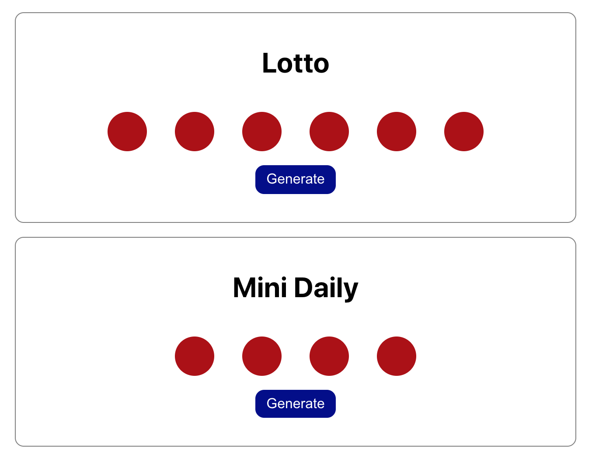

# Lottery

### Description

This React project aims to
* Practice updating state based off of existing state
* Properly manage state updates for mutable data structures
* Use best practices for modeling state and designing components

The goal is to create a lottery application that displays an interface that looks like this:

The Lottery component should be reusable and flexible.

### Technologies

*Languages:* Javascript, HTML, CSS

*Library:* React

### Key features

* Display two lottery games:
  * a first one with default properties: a "Lotto" title, 6 balls with values between 1 and 40
  * a second one with customisable properties, e.g. a "Mini Daily" title, 4 balls with values between 1 and 10
* Generate a lottery draw when clicking on a button

### Poject status

The project is done.

### Credits & Sources

* Another small project from [The Modern React Bootcamp](https://www.udemy.com/course/modern-react-bootcamp)
